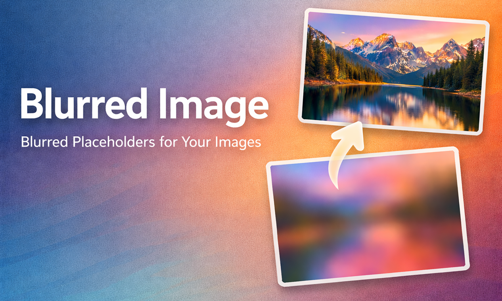

<div align="center">بسم الله الرحمن الرحيم</div>
<div align="left">

# blurred-image

[](https://packagist.org/packages/goodm4ven/blurred-image)
[](https://github.com/goodm4ven/PACKAGE_LARAVEL_blurred-image/actions?query=workflow%3Apest+branch%3Amain)
[](https://codecov.io/gh/goodm4ven/PACKAGE_LARAVEL_blurred-image)
[](https://packagist.org/packages/goodm4ven/blurred-image)

An elegant wrapper around [Blurhash](https://blurha.sh) for the [TALL stack](https://tallstack.dev), so Laravel projects can show colorful blurred placeholders while the real image loads.



https://github.com/user-attachments/assets/704b4a8a-55d7-4a2d-bb28-d41b3301bca5


## How it works

1. Generate a tiny blurred thumbnail for the image you want to render. You can do that via the Artisan command, the `BlurredImage` facade, or by registering a conversion through Spatie Media Library.
2. Pass both the final image URL (or the associated Media Library model+collection) and the thumbnail URL to the [Blade component](https://laravel.com/docs/blade) called `blurred-image`.
3. The component:
   - Renders an empty gray canvas immediately.
   - Sends the thumbnail through Blurhash to animate a colorful, blurred version of the image.
   - Replaces the blurhash with the real image once it has fully intersected the viewport or finished downloading, depending on your configuration.

Once configured, the component handles the placeholder animation for you so you can focus on content.


## Installation

Install the package with [`Composer`](https://getcomposer.org/):

```bash
composer require goodm4ven/blurred-image
```

If you use [Spatie's Laravel Media Library](https://spatie.be/docs/laravel-medialibrary/) and want the `model`/`collection` scenario, install that package and add the `HasBlurredImages` trait to your model so `addBlurredThumbnailConversion` conversion method becomes available:

```bash
composer require spatie/laravel-medialibrary
```

```php
use GoodMaven\BlurredImage\Concerns\HasBlurredImages;
use Spatie\MediaLibrary\HasMedia;
use Spatie\MediaLibrary\InteractsWithMedia;

class User extends Model implements HasMedia
{
    use InteractsWithMedia;
    use HasBlurredImages;

    public function registerMediaCollections(): void
    {
        $this
            ->addMediaCollection('profile-picture')
            ->singleFile()
            ->registerMediaConversions(function (Media $media) {
                $this->addBlurredThumbnailConversion();
            });
    }
}
```

Publish the assets so the JavaScript helper, CSS, and placeholder images are copied to `public/vendor/blurred-image`.

```bash
php artisan vendor:publish --tag="blurred-image-assets"
```
</div>


> [!NOTE]
> You should add the **enforced** asset publishing process to your app composer's workflow:
  ```
  {
      ...
      "scripts": {
          ...
          "post-autoload-dump": [
              ...
              "@php artisan vendor:publish --tag=blurred-image-assets --force --ansi"
  ```


> [!WARNING]
> Note that [AlpineJS](https://alpinejs.dev) and its [Intersect plugin](https://alpinejs.dev/plugins/intersect) are not bundled with these assets.


<div align="left">
You may also publish additional resources to tailor the package to your project:

- Config file (to adjust defaults such as `conversion_name` and the component flags):
  ```bash
  php artisan vendor:publish --tag="blurred-image-config"
  ```

  - Check the current [configurations](config/blurred-image.php) for more settings.

- Views (if you need to override the Blade template):
  ```bash
  php artisan vendor:publish --tag="blurred-image-views"
  ```

### Notes

- **Static assets**: Generate a `*-blur-thumbnail.*` file next to your source image with `php artisan blurred-image:generate <imagePath>` so the blurhash can render client-side.
- **Optimization**: `is_generation_optimized` is enabled by default and runs `blurred-image:optimize` on both the source image and the generated thumbnail whenever you call the generator command.
- **Media Library collections**: Always sync `conversion_name` with the config by using `addBlurredThumbnailConversion` from the `HasBlurredImages` trait.
- **Intersection/delay**: Set `is_eager_loaded` to preload the image or leave it `false` to wait for intersection; adjust `is_display_enforced` if the final image should appear before an intersection callback.


## Usage

- **Load both [AlpineJS](https://alpinejs.dev) and its [Intersect plugin](https://alpinejs.dev/plugins/intersect) before using the component.**

- Generate a blurred thumbnail before the first render:
  ```bash
  php artisan blurred-image:generate storage/app/public/example.jpg
  ```
  ```php
  use GoodMaven\BlurredImage\Facades\BlurredImage;

  BlurredImage::generate(storage_path('app/public/example.jpg'));
  ```

### Use cases overview

Use the `blurred-image` component in two primary ways:

1. **Static assets**: Pass explicit image and thumbnail URLs for banners, seeded data, etc.
2. **Media Library**: Provide a model and collection, letting the component read the conversion registered via `HasBlurredImages`. Use `mediaIndex` to select from multiple media items.

Extra options to consider:

- **Slot overlays**: Place foreground content inside the component slot so your UI sits atop the blurhash and final image.
- **Intersection tuning**: Toggle `is_eager_loaded` to preload the image, toggle `is_display_enforced` to reveal the final image before intersection fires.

### 1. Render with explicit paths

```blade
<x-goodmaven::blurred-image
    :imagePath="asset('images/hero.jpg')"
    :thumbnailImagePath="asset('images/hero-blur-thumbnail.jpg')"
    :isDisplayEnforced="true"
    alt="Coastal trail"
/>
```

### 2. Render from the Media Library

Attach media to a model that uses `HasBlurredImages` and its conversion method:

```php
$user = User::first();

$user
    ->addMedia($pathToImage)
    ->preservingOriginal()
    ->toMediaCollection('profile-picture');
```

```blade
<x-goodmaven::blurred-image
    :model="$user"
    :collection="'profile-picture'"
    :mediaIndex="0"
/>
```

### Extra: Slot overlays and intersection tweaks

```blade
<x-goodmaven::blurred-image
    :image-path="asset('images/poster.jpg')"
    :thumbnail-image-path="asset('images/poster-blur-thumbnail.jpg')"
    :is-eager-loaded="false"
    :is-display-enforced="false"
    width-class="w-full"
    height-class="h-[520px]"
>
    <div class="absolute inset-0 bg-linear-to-t from-black/60"></div>
    <div class="relative z-10 p-6 text-white">
        <p class="text-lg font-semibold">Deferred reveal</p>
        <p class="text-sm text-white/70">Blurhash shows immediately; the full image waits for an intersection.</p>
    </div>
</x-goodmaven::blurred-image>
```

Configuration for flags such as `is_eager_loaded`, `is_display_enforced`, and the `conversion_name` lives in the configuration file.

### Edge Case

</div>

> [!IMPORTANT]
> If the parent element, that contains the component, **doesn’t have an explicit `height`**, like being `absolute` or whatever, **you MUST explicitely set the `heightClass` yourself**; like providing `aspect-[4/3]` or `h-48` classes. And ensure a proper `width` too. You can check the props defaults at the top of [blurred-image.blade.php](./resources/views/components/blurred-image.blade.php) file.

<div align="left">


## Development

This package was initiated based on my [Laravel package template](https://github.com/goodm4ven/TEMPLATE_PACKAGE_TALL/blob/main/README.md#development) that is built on top of [Spatie's](https://github.com/spatie/package-skeleton-laravel). Make sure to read the docs for both.

### Tasks

- // TODO Rework the demo Livewire component setup to load more images into the page, from both DB and fake-urls, and visualize the benifit


## Support

Support ongoing package maintenance as well as the development of **other projects** through [sponsorship](https://github.com/sponsors/GoodM4ven) or one-time [donations](https://github.com/sponsors/GoodM4ven?frequency=one-time&sponsor=GoodM4ven) if you prefer.

### Credits
- Inspired by [Blurhash](https://github.com/woltapp/blurhash).
- [TALL Stack Community](https://tallstack.dev)
- [TailwindCSS](https://tailwindcss.com)
- [AlpineJS](https://alpinejs.dev)
- [Laravel](https://laravel.com)
- [Laravel Media Library](https://github.com/spatie/laravel-medialibrary)
- [Spatie Team](https://github.com/Spatie)
- [ChatGPT & Codex](https://developers.openai.com/codex)
- [GoodM4ven](https://github.com/GoodM4ven)
- [All Contributors](../../contributors)

</div>
<br>
<div align="center">والحمد لله رب العالمين</div>
